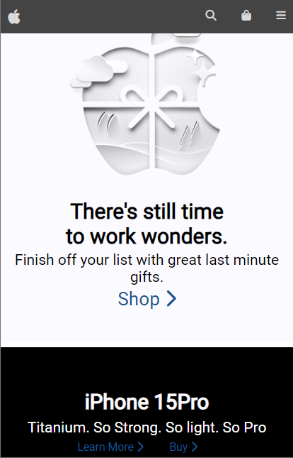

# Responsive Apple Website Clone

A responsive clone of the Apple website, demonstrating front-end development skills and responsive design and mobile-first techniques.

## Table of Contents
- [Demo](#demo)
- [Features](#features)
- [Technologies Used](#technologies-used)
- [Installation](#installation)
- [Usage](#usage)
- [Contributing](#contributing)
- [License](#license)

## Demo
Visit the [live demo](https://appleclone-horatio.netlify.app/) to see the project in action.

## Features
- Responsive design for various devices (desktop, tablet, mobile).
- Recreated Apple website layout, including the navigation bar, product sections, and footer.

## Technologies Used
- HTML5
- CSS3 (Flexbox, Grid)
- JavaScript
- [FontAwesome](https://fontawesome.com) - For icons

## Installation
1. Clone the repository: `git clone https://github.com/your-username/apple-website-clone.git`
2. Navigate to the project folder: `cd apple-website-clone`
3. Open `index.html` in your preferred web browser.

## Usage
Open the project in a web browser to explore the responsive design and layout.

## Contributing
Contributions are welcome! If you find any issues or have suggestions for improvements, please open an issue or create a pull request.

## License
This project is licensed under the [MIT License](LICENSE.md).
